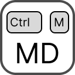

  

<h1 align="center">Save as Markdown</h1>

  A Chrome extension that saves any web page as a Markdown file with a single shortcut — press <kbd>Ctrl</kbd>+<kbd>M</kbd> the way you'd press <kbd>Ctrl</kbd>+<kbd>P</kbd> to print to PDF.

  
  
  

---

## Features

- **One-key save**: press <kbd>Ctrl</kbd>+<kbd>M</kbd> (<kbd>⌘</kbd>+<kbd>M</kbd> on macOS) or click the toolbar icon to download the current page as a `.md` file named after the page title.
- **Main content detection**: saves the page's main article or content area and leaves out menus, footers, scripts and forms. You can switch to whole-page mode in the settings.
- **Clean Markdown**: converts headings, paragraphs, bold/italic/strikethrough, links, images, nested lists, blockquotes, code blocks (with language hints) and tables. Links and images keep their full URLs.
- **Right-click settings**: right-click the toolbar icon and choose **Options** to change how pages are saved.
- **No dependencies**: written in plain JavaScript, with no external libraries or network requests.

## Installation

This extension isn't on the Chrome Web Store. Install it as an unpacked extension:

1. Download or clone this repository.
2. Open `chrome://extensions` in Chrome.
3. Enable **Developer mode** (top-right toggle).
4. Click **Load unpacked** and select the project folder.
5. Pin the extension for quick access from the toolbar.

## Usage

1. Open any web page.
2. Press <kbd>Ctrl</kbd>+<kbd>M</kbd>, or click the extension icon.
3. The page is saved as a Markdown file in your Downloads folder.

If the shortcut doesn't work, another extension may already be using it. You can assign a different one at `chrome://extensions/shortcuts`.

> Chrome doesn't allow extensions to run on its own pages (`chrome://…`) or on the Chrome Web Store, so pages there can't be saved.

## Options

Right-click the toolbar icon and choose **Options**. Changes save automatically.

| Setting | Default | Description |
|---|---|---|
| Ask where to save each file | Off | Shows a *Save as* dialog instead of downloading directly |
| Save into subfolder | *(empty)* | A subfolder inside Downloads, e.g. `Markdown/Web` |
| Content to save | Main content only | *Main content only* or *Whole page* (whole page keeps menus and footers) |
| Include images | On | Adds images as `` links |
| Add page title and source URL | On | Starts the file with the page title and the URL it was saved from |

## How it works

When you trigger a save, [background.js](background.js) uses the `scripting` API to inject a converter into the current tab. The converter finds the largest `<article>`, `<main>` or `[role="main"]` element. If that element holds less than half of the page's text, it's probably just a teaser card, so the converter uses the whole `<body>` instead. It then walks the DOM, skipping hidden elements, and builds the Markdown. The result is handed to the `downloads` API as a `data:` URL, so the file is created locally without leaving your machine.

## Permissions

| Permission | Why it's needed |
|---|---|
| `activeTab` | Reads the current page, only when you press the shortcut or click the icon |
| `scripting` | Injects the HTML-to-Markdown converter into that page |
| `downloads` | Saves the generated `.md` file |
| `storage` | Saves your settings (`chrome.storage.sync`) |

## Privacy

Pages are converted entirely inside your browser. The extension makes no network requests and has no access to any page until you trigger it. Your settings are stored via `chrome.storage.sync` and synced through your own Chrome profile.
